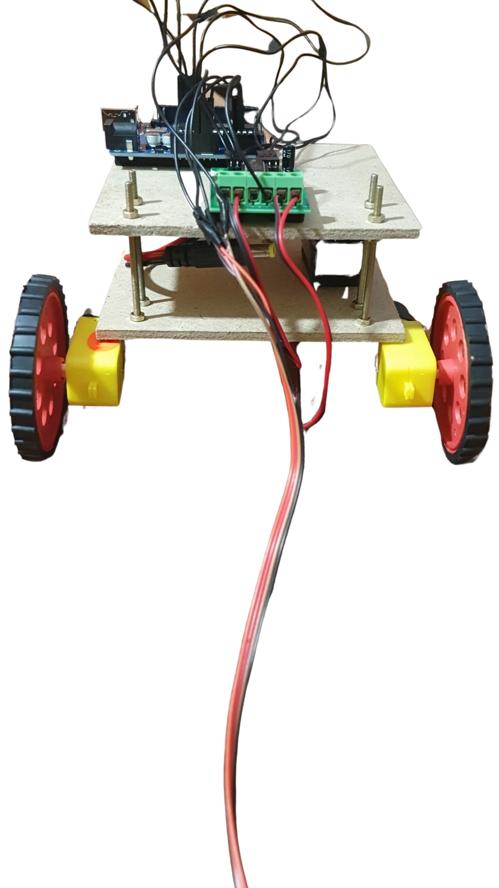

# Gesture-Based-UI-Project-Robot-2021

## OverView
This Repository contains programming script, images, and documentation for a Gesture based robot which is a robot controlled by hand gestures. The user has a sensor on his hand to detect the motion cause by different hand gestures. Depending on the Gestures detected by the sensor the robot moves accordingly such as left , right , up and down.

### How it works:

Connect the big round pin wire with the Arduino uno Board. This will power on the Robot and Robot
will start moving. Take the accelerometer sensor attached with cardboard in hand. The Arrow Mark
on the card points to the forward direction along x-axis. Now if the the sensor is flat i.e at ground
level then the robot will stop. To move the Robot, we can tilt the sensor in any direction along x-axis
or y-axis to move the robot in that direction. You will find more information about gestures
identified below.

## Hardware used

- 4 core cable
- Arduino Uno
- Arduino Uno USB Cable
- Accelerometer ADXL335 Sensor
- L293D Motor Driver Circuit
- DC motors
- 2 Wheels for Motors
- 1 Castor Wheels
- Connecting Wires
- Pin connectors wire
- Barrel connector wire
- 1 board for Chassis
- 2 U Clamps
- Screws and nuts
- Tapes insulation and double sided tape
- 9 - volt battery
- 9 - volt battery connectors

## Architecture for the solution

This Gesture Based Robot have an Accelerometer Sensor that provides the necessary inputs based
on the detection of gestures. I have used ADXL335 Accelerometer Sensor in this Project. These
inputs from the sensor are send to the brain of the robot which is the Arduino uno in my case. The
Arduino uno is programmed using graphical programming language called scratch Arduino. I have
programmed Arduino to detect inputs and make necessary actions to make the robot move and
finally the Robot which have a board chassis with 2 wheels with 2 Dc Motors and 1 Castor wheel at
the front is actuated by the Arduino Uno. The Dc Motors are driven by the motor driver which
provide the necessary voltages to both motors to move the robot in accordance to the sensor input.

One 9 Volt battery is connected to the Motor Driver to power the Dc motors and other 9 volt battery
is connected to the Arduino uno to power the Arduino uno.

## Main Logic

In a loop continuously read and store the values of the Analog pin A1 which is connected to the x-out
and Analog pin A2 which is connected to the y-out of the ADXL

#### Move Forward Logic:

Check if the x axis reading is less than 300 then turn the digital pin 10 and pin 1 2 output to High, pin
11 and 13 to Low to move both motors clockwise so that robot moves forward.

#### Move Backward Logic:

Check if the x axis reading is greater than 3 5 0 then turn the digital pin 10 and pin 1 2 output to Low,
pin 11 and 13 to High to move both motors anti-clockwise so that robot moves backwards.

#### Move Right Logic:

Check if the y axis reading is greater than 3 5 0 then turn the digital pin 10 and pin 1 3 output to Low,
pin 11 and 1 2 to High to move Right motor backwards and Left motor forward so that robot moves
to the right

#### Move Left Logic:

Check if the y axis reading is less than 3 0 0 then turn the digital pin 10 and pin 1 3 output to High, pin
11 and 1 2 to Low to move Left motor backwards and Right motor forward so that robot moves to
the Left.

#### Stop Logic:

Check if the y axis and x axis reading is greater than 3 00 and less than 350 then turn the digital pin
10,11,12 and 13 to Low to stop the robot.

